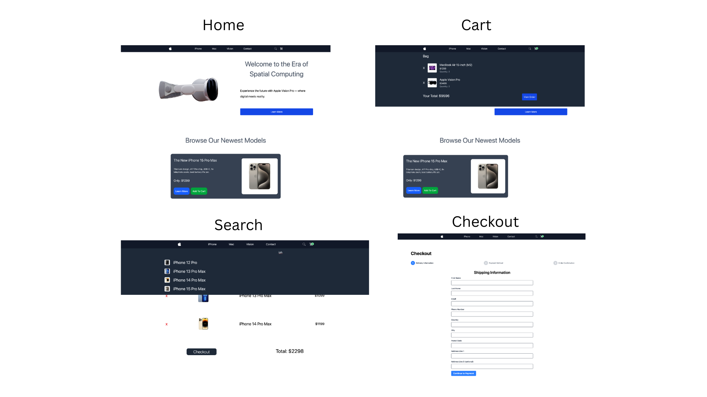
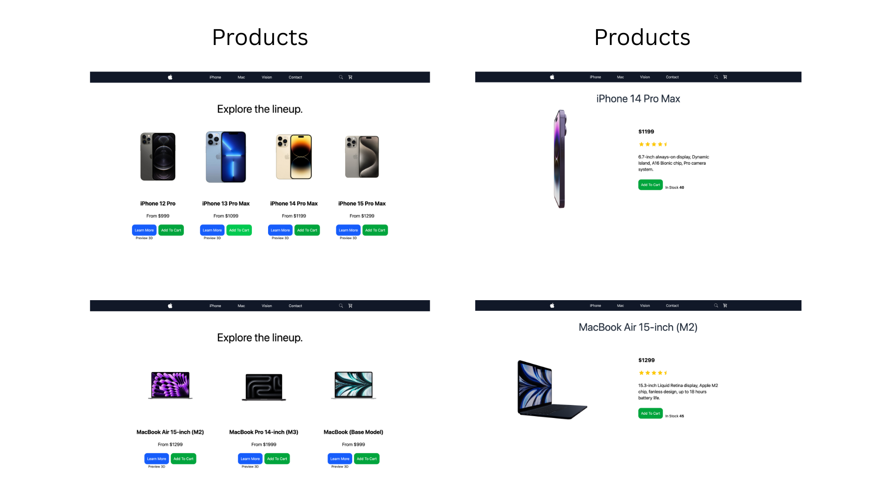
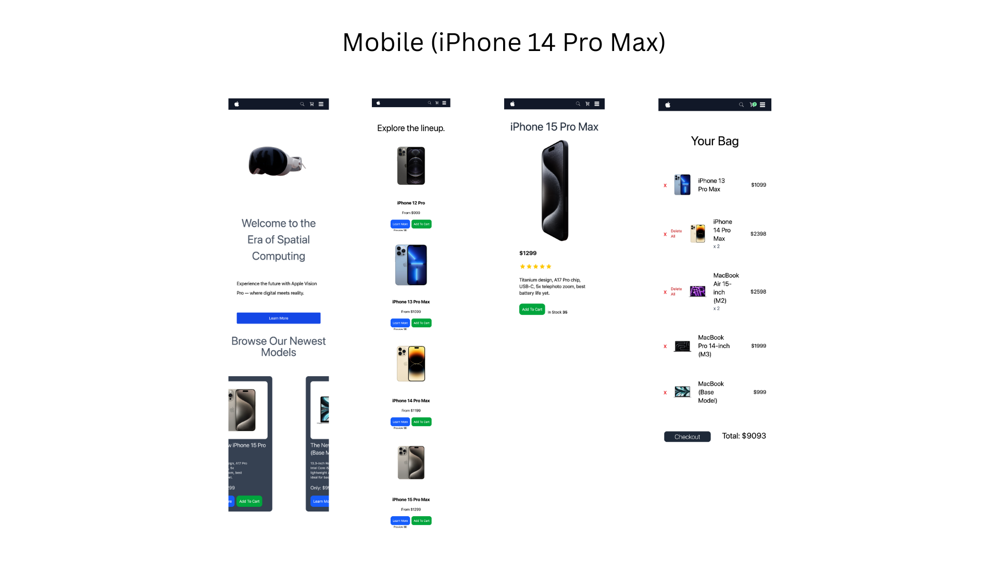

# 🍎 3D Apple Store

An immersive, fully responsive Apple-inspired e-commerce experience with interactive 3D product models — built using React, R3F, TailwindCSS, and Vite.

---

## 🧠 Features

- 🔁 **Landing Page** with a rotating 3D Apple Vision Pro and a slider showcasing the latest products  
- 🌐 **Responsive Navigation Bar** with links to:
  - iPhone
  - Mac
  - Vision
  - Contacts
  - Search
  - Cart
- 🧭 **Product Exploration**
  - View all products as image cards
  - Navigate to a detailed product page with an 3D model
  - Add products to cart from any view
- 🔍 **Search Functionality**
  - Instantly filter products by name
- 🛒 **Cart & Checkout Simulation**
  - Add products to your cart
  - Simulate a purchase by entering user information
- 📱 **Fully Responsive**
  - Mobile, tablet, and desktop friendly design using TailwindCSS

---

## 🚀 Tech Stack

- **React** + **React DOM** – Frontend framework  
- **React Three Fiber** + **Drei** – 3D rendering and helper components  
- **Three.js** – 3D graphics engine  
- **TailwindCSS** – Utility-first CSS framework  
- **Vite** – Lightning-fast development environment  
- **React Router DOM** – Routing and navigation  
- **vite-plugin-svgr** – Import SVGs as React components

---

## 📦 Dependencies

```json
"dependencies": {
  "@react-three/drei": "^10.0.6",
  "@react-three/fiber": "^9.1.2",
  "@tailwindcss/vite": "^4.1.4",
  "react": "^19.0.0",
  "react-dom": "^19.0.0",
  "react-router-dom": "^7.5.1",
  "tailwindcss": "^4.1.4",
  "three": "^0.175.0",
  "vite-plugin-svgr": "^4.3.0"
}
```

---

## 📸 Screenshots





---

## 🛠️ Installation & Usage

1. **Clone the repository**  
   ```bash
   git clone https://github.com/yourusername/3d-apple-store.git
   ```

2. **Install dependencies**  
   ```bash
   npm install
   ```

3. **Start the development server**  
   ```bash
   npm run dev
   ```


---

## 📝 License

This project is open source and available under the [MIT License](LICENSE).
